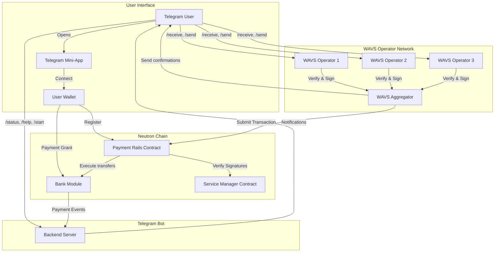
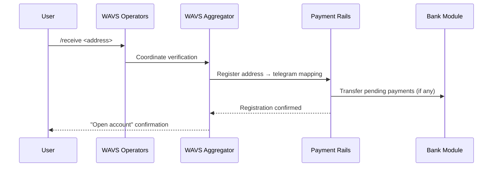
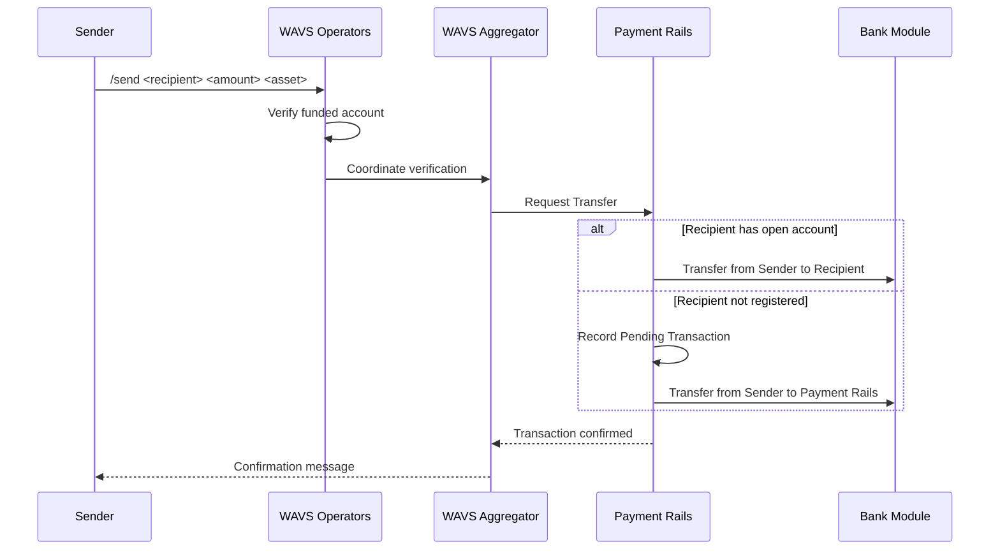
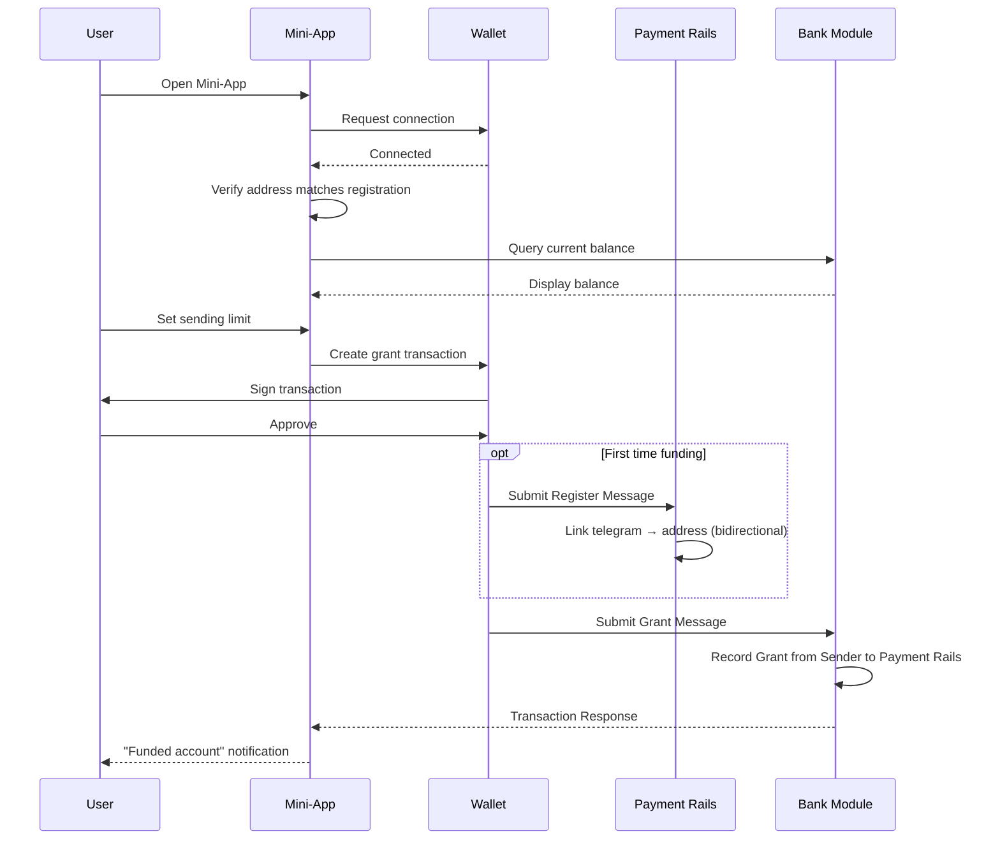
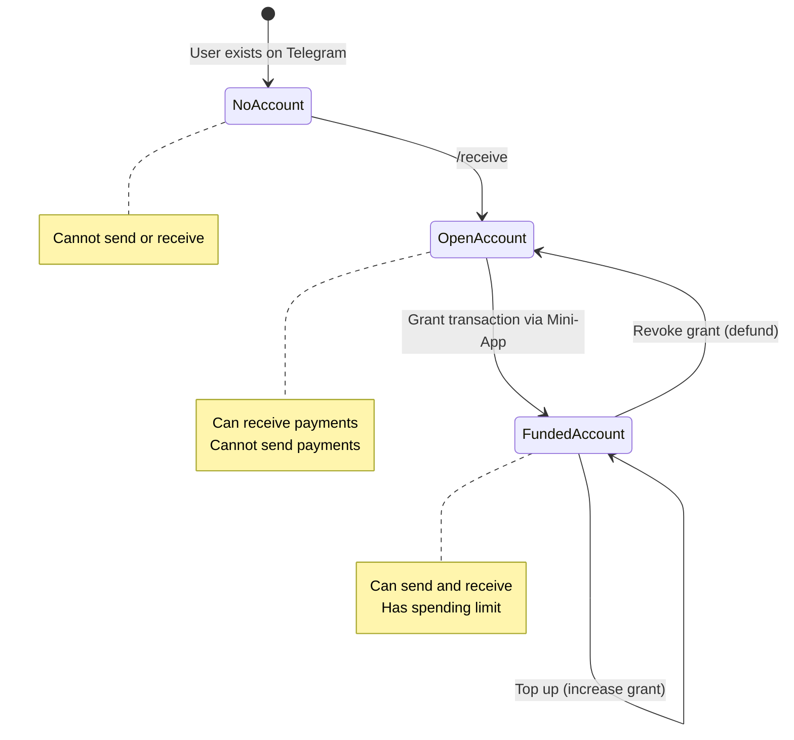

# Architecture

## System Overview

The Telegram Payments system enables secure, decentralized payments on Cosmos chains through Telegram. The architecture consists of three main components working together: a Telegram Bot for user interaction, a WAVS Operator Set for secure transaction validation, and Payment Rails smart contracts for on-chain execution.

## High-Level Architecture Diagram

## Component Architecture

### 1. Telegram Bot (Quick Operations)

**Purpose**: Handle non-secure, fast user interactions

**Responsibilities**:
- Read-Write-access to TG API (Main Entry Point)
- Provide basic instructions upon `/help` and `/start`
- Handle `/status` command queries
- Listen for on-chain payment events
- Send payment notification messages to users
- Provide links to Mini-App URL

**Technology Stack**:
- Single process bot implementation
- Direct integration with Telegram Bot API
- Read-only blockchain monitoring

**Security Model**: No access to funds or sensitive operations

### 2. WAVS Operator Network

**Purpose**: Decentralized, secure validation of Telegram messages and transaction execution

**Components**:

#### WAVS Operators (Multiple Nodes)
- Read-access to TG API (Listen)
- Verify Telegram message authenticity
- Validate user permissions and limits
- Create and sign messages for blockchain transactions

#### WAVS Aggregator
- Write-access to TG API (Tx Receipts)
- Aggregate signatures from operator quorum
- Submit multi-signed transactions to blockchain
- Send confirmation or error messages back to Telegram Bot (tx response)

**Responsibilities**:
- Handle `/receive` command (register open accounts)
- Handle `/send` command (execute payments)
- Verify sending limits and account status
- Coordinate multi-party transaction signing

**Security Model**:
- Based on slashable restaked assets
- Requires quorum consensus for all operations
- No single point of failure

### 3. Payment Rails Smart Contract

**Purpose**: On-chain execution of payment logic

**Key Functions**:

#### Account Management
- Store mapping: `blockchain_address → telegram_handle(s)`
- Store reverse mapping: `telegram_handle → blockchain_address`
- Track account status: "no account", "open", "funded"

#### Payment Execution
- Receive grant permissions from user wallets
- Execute transfers within approved limits
- Route payments to registered addresses
- Store unclaimed payments in vault

#### Vault Management
- Hold payments for unregistered recipients
- Release funds when recipient registers
- Maintain pending payment records

**Technology Stack**:
- CosmWasm smart contract
- Deployed on each supported Cosmos chain
- Integrates with Cosmos SDK grant module

### 4. Telegram Mini-App

**Purpose**: Secure wallet interactions for funding operations

**Responsibilities**:
- Connect to user's wallet (Keplr, WalletConnect)
- Display account status and balance
- Create register transactions to link blockchain address to Telegram handle
- Create grant transactions for funding
- Revoke grants for defunding
- Add additional funds (top-up)

**User Flows**:
- Register to send (initial grant)
- Top up account (increase grant)
- Defund account (revoke grant)

**Security Model**:
- Direct wallet connection (no intermediary)
- User signs all transactions
- Verifies wallet address matches registration

## Data Flow Diagrams

### Registration Flow (Receive)

### Send Payment Flow

### Funding Flow (Direct to Blockchain)

## Account State Model

## Security Architecture

### Multi-Layer Security

1. **Telegram Layer**
   - Bot API authentication
   - Message verification
   - Rate limiting

2. **WAVS Operator Layer**
   - Slashable restaked assets
   - Quorum consensus requirement
   - Byzantine fault tolerance
   - Independent operator verification

3. **Blockchain Layer**
   - Grant-based permissions (not custody)
   - Spending limits enforced on-chain
   - Immutable transaction records
   - User can revoke access anytime

### Attack Mitigation

**Handle Squatting Prevention**:
- Separate registration for sending vs receiving
- Receiving: Telegram message proves handle ownership
- Sending: On-chain transaction proves address ownership
- Both required for full bidirectional mapping

**Fund Security**:
- Users maintain custody of funds
- Operators only have limited grant permissions
- Users can revoke grants at any time
- Spending limits prevent total fund drain

**Operator Collusion**:
- Requires quorum consensus
- Slashable stakes for misbehavior
- Transparent on-chain execution
- Users can monitor all transactions

## Technology Stack

### Backend
- **Telegram Bot**: Rust Axiom Server with Telegram Bot API
- **WAVS Service**: Rust WASI Components

### Smart Contracts
- **Language**: Rust
- **Framework**: CosmWasm
- **Chains**: Neutron, other Cosmos chains

### Frontend
- **Mini-App**: React
- **Wallet Integration**: Keplr, Leap, Cosmostation
- **UI Framework**: Telegram Mini-App SDK

## Deployment Architecture

### Infrastructure Components

1. **Telegram Bot Server**
   - Single instance (can be replicated for HA)
   - Webhook mode
   - Stateless design (query state from blockchain)

2. **WAVS Operator Network**
   - Distributed across multiple operators
   - Each operator runs independent node
   - Aggregator coordinates consensus

3. **Smart Contracts**
   - Deployed per supported chain
   - Immutable code (or governed upgrades)
   - Shared state across operator interactions

4. **Mini-App Hosting**
   - Static site hosting (CDN)
   - Client-side wallet integration
   - No backend required

## Scalability Considerations

- **Horizontal Scaling**: Add more WAVS operators for increased security
- **Chain Support**: Deploy Payment Rails to additional Cosmos chains, WAVS Service can route payments to chain based on requested asset
- **Event Processing**: Async payment notification queue
- **Rate Limiting**: Protect against spam and abuse

## Future Enhancements

- Multi-chain support (auto-route based on asset)
- Multi-asset support per transaction
- Scheduled/recurring payments
- Enhanced privacy features (tg handles to blockchain addresses not public)
